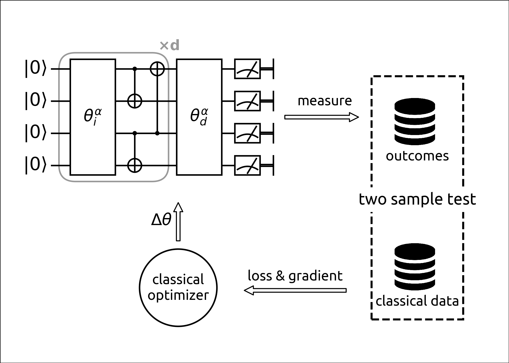

# Quantum Circuit Born Machine - the Demo
Gradient based training of Quantum Circuit Born Machine (QCBM)

## Table of Contents
This project contains

* `notebooks/qcbm_gaussian.ipynb` (or [online](https://drive.google.com/file/d/1LfvWuM8rUPOtdWFRbUhSyjn35ndR7OW6/view?usp=sharing)), basic tutorial of training 6 bit Gaussian distribution using QCBM,
* `notebooks/qcbm_advanced.ipynb` (or [online](https://drive.google.com/file/d/18EDWlGacQMONJ1sxhGlQ9M3aQ5619B8F/view?usp=sharing)), an advanced tutorial,
* `qcbm` folder, a simple python project for productivity purpose.



## Setup Guide
Set up your python environment

* python 3.6
* install python libraries

If you want to read notebooks only and do not want to use features like [`projectq`](https://github.com/ProjectQ-Framework/ProjectQ), having `numpy`, `scipy` and `matplotlib` is enough.
To access advanced features, you should install `fire`, `projectq` and `climin`.
```bash
$ conda install -c conda-forge pybind11
$ pip install -r requirements.txt
```

Clone this repository [https://github.com/GiggleLiu/QuantumCircuitBornMachine.git](https://github.com/GiggleLiu/QuantumCircuitBornMachine.git) to your local host.

### Access online materials
1. Sign up and sign in [Google drive](https://drive.google.com/)
2. Connect Google drive with [Google Colaboratory](https://colab.research.google.com)
    - right click on google drive page
    - More
    - Connect more apps
    - search "Colaboratory" and "CONNECT"
3. You can make a copy of notebook to your google drive (File Menu) to save your edits.

## Run Bar-and-Stripes Demo on Your Localhost

```bash
$ ./program.py checkgrad  # check the correctness of gradient
$ ./program.py statgrad  # check gradient will not vanish as layer index increase.
$ ./program.py vcircuit  # visualize circuit using ProjectQ
$ ./program.py train   # train and save data.
$ ./program.py vpdf   # see bar stripe dataset PDF
$ ./program.py generate  # generate bar and stripes using trainned circuit.
```

## Documentations

* paper: Differentiable Learning of Quantum Circuit Born Machine ([pdf](docs/1804.04168.pdf)), [arXiv:1804.04168](https://arxiv.org/abs/1804.04168), Jin-Guo Liu, Lei Wang
* slides: [online](https://docs.google.com/presentation/d/1ZNysy-MUlkPfuxUtZMz_Sd8Mz43oC6y7FcyeGGMaQoU/edit?usp=sharing)

## Citation

If you use this code for your research, please cite our paper:

```
@article{Liu2018,
  author = {Jin-Guo Liu and Lei Wang},
  title = {Differentiable Learning of Quantum Circuit Born Machine},
  year = {2018},
  eprint = {arXiv:1804.04168},
  url = {https://arxiv.org/abs/1804.04168}
}
```

## Authors

* Jin-Guo Liu <cacate0129@iphy.ac.cn>
* Lei Wang <wanglei@iphy.ac.cn>
